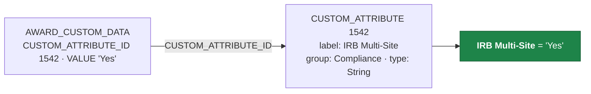

# BU Grants Data Mapping Guide

## Purpose

BU has prepared a structured representation of its Kuali Coeus (KC) Grants data to
support Huron's HRS mapping work. The repository is organized around Grants business
objects rather than individual database tables, so each area can be understood as a
whole.

## Suggested starting point

For mapping purposes, `reference/KUALI_FIELD_DICTIONARY.csv` may be the most useful
starting point.

KC's Oracle schema contains no column comments, so the database alone conveys column
names and datatypes but little business meaning. BU supplemented the database metadata
with information traced from the Kuali application itself — its ORM mappings, its
DataDictionary, and its screens — so each field carries:

| Column | Meaning |
|---|---|
| `DB_TABLE` / `DB_COLUMN` | Oracle storage |
| `JAVA_OBJECT` / `JAVA_PROPERTY` | the application property behind it |
| `UI_FIELD_NAME` | the label BU users see on screen |
| `LOOKUP_TABLE` / `LOOKUP_COLUMN` | the reference object that decodes a coded value |
| `FIELD_ORIGIN` | `CORE_KUALI`, `BU_EXTENSION`, `BU_CUSTOM_ATTRIBUTE`, `LOOKUP_REFERENCE` |
| `MAPPING_PRIORITY` | business relevance, with technical columns marked `NOT_FOR_HURON` |
| `CONFIDENCE` | whether the column was verified in production and a label resolved |

Where `UI_FIELD_NAME` is blank, BU did not find enough evidence in the source to assert
a label, so none was recorded. Screen labels frequently differ from the underlying
property name — `AWARD.AWARD_NUMBER` appears as "Award ID", and `PROPOSAL.TITLE` as
"Project Title" — which is much of the value in this file.

The `SOURCE_FILE` column records where each label and mapping was traced from, if it is
ever helpful to audit a particular field.

## Business object modules

| Module | Contents |
|---|---|
| `modules/award/` | Award — 108 relationships, 238 UI fields |
| `modules/proposal/` | Institutional Proposal — 64 relationships, 138 UI fields |
| `modules/subaward/` | Subaward — 32 relationships, 156 UI fields |
| `modules/negotiation/` | Negotiation — 15 relationships, 46 UI fields |

Each module contains a business-object graph (`*_GRAPH.md` explains it, `*_GRAPH.csv` is
machine readable), a UI-to-database field mapping, a read-only SQL representation under
`sql/`, and the findings and open questions specific to that area.

A few relationships are worth mentioning because they cross modules. A Subaward connects
to its funding Award through `SUBAWARD_FUNDING_SOURCE`, which records the specific award
*version* that funded it — `FUNDING_AWARD_NUMBER` reaches the current Award root. A
Negotiation can be about an Award, a Subaward or an Institutional Proposal, and which one
depends on its association type, so that dataset carries an
`ASSOCIATED_DOCUMENT_ID_MEANS` column to make the key readable.

## SQL representation

BU has preserved one-to-many relationships as separate datasets rather than joining
them into a single result. For Award, that means:

```
Award root
  → people
  → amounts
  → terms
  → special reviews
  → custom fields
```

This avoids Cartesian row multiplication — a single award with 5 people, 12 terms and
40 custom fields would otherwise produce 2,400 duplicate award rows — and keeps the
original relationships intact. Descriptive many-to-one lookups are folded into the root
as code plus description, since those cannot multiply rows. Every child dataset carries
the root keys so the graph can be reassembled.

Each module also includes a nested JSON proof of concept, which returns one complete
business object as a single document, in case that shape is useful.

## KC data characteristics

**Versioned records.** KC stores multiple sequences of a business record, so physical
row counts are considerably larger than business record counts:

| | Physical rows | Business records |
|---|---|---|
| Award | 282,468 | 43,202 |
| Institutional Proposal | 130,122 | 36,863 |
| Subaward | 93,061 | 3,466 |
| Negotiation | 11,842 | 11,842 |

Each module documents the logic that identifies the current record, worked out from
production evidence rather than assuming `MAX(SEQUENCE_NUMBER)` is always right. All four
turned out differently: Award, Institutional Proposal and Subaward each needed their own
rule, and Negotiation is not versioned at all — one row is one negotiation. Each module's
validation query shows the counts and exceptions behind its rule.

**BU custom fields.** KC stores institution-specific fields in an
entity-attribute-value model: `CUSTOM_ATTRIBUTE` holds the field definitions and
`*_CUSTOM_DATA` holds the values, linked by `CUSTOM_ATTRIBUTE_ID`.



BU has resolved its 107 configured custom attributes into their business labels,
groups and datatypes, so the `*_custom.sql` datasets present each field by name
alongside its value. Definitions are also available in `reference/custom-attributes/`.

## Supporting discovery material

`discovery/` contains BU's broader analysis of the KC schema — all 901 tables
classified by domain, a full data dictionary, and the extraction queries used. It is
the supporting research behind the business-object models, and may be helpful when a
question calls for deeper investigation of the source schema.

## Current status

| Module | State |
|---|---|
| Award | Complete |
| Institutional Proposal | Complete |
| Subaward | Complete |
| Negotiation | Complete |

## Joint review items

Some findings are documented rather than resolved, because they are questions of
migration scope or historical data rather than mapping decisions — for example legacy
identifiers that no longer resolve, and custom attributes whose module configuration
does not match where their values appear. These are recorded at the end of each
module's `*_GRAPH.md` as items that may benefit from joint BU/Huron review.
