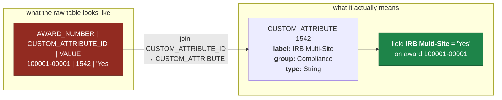

# Start here (Huron)

This repo models BU's Kuali Coeus Grants data for mapping into HRS. It is organised by
**business object**, not by table.

## Read in this order

**1. `reference/KUALI_FIELD_DICTIONARY.csv`** — start here, not with the schema.

KC stores **no column comments in Oracle at all**. A raw schema dump would give you
column names and datatypes and nothing else. This file supplies the missing meaning:
each Oracle column traced to its Java property, the **actual label BU users see on
screen**, the lookup that decodes it, and a mapping priority.

| Column | Use |
|---|---|
| `UI_FIELD_NAME` | The on-screen label. Blank means "not asserted" — never guessed |
| `MAPPING_PRIORITY` | Filter to `HIGH` first; `NOT_FOR_HURON` marks technical columns |
| `FIELD_ORIGIN` | `CORE_KUALI`, `BU_EXTENSION`, `BU_CUSTOM_ATTRIBUTE`, `LOOKUP_REFERENCE` |
| `CONFIDENCE` | `HIGH` = column verified in production **and** a label resolved |

Do not infer a label from the Java property name. `AWARD.AWARD_NUMBER` is
**"Award ID"** on screen; `PROPOSAL.TITLE` is **"Project Title"**.

**You do not need to read any Kuali source.** Everything here is CSV and SQL. The
`JAVA_CLASS`, `JAVA_PROPERTY` and `SOURCE_FILE` columns are provenance — they record
where each label and mapping came from so a disputed field can be traced back to the
exact file. Ignore them unless you want to audit a specific mapping.

**2. `modules/<object>/`** — one directory per business object.

`modules/award/` is complete. Each contains the object graph (`*_GRAPH.md` explains it,
`*_GRAPH.csv` is machine readable), the full UI-field-to-database mapping, and a
read-only SQL interface under `sql/`.

**3. `modules/<object>/sql/`** — the interface itself.

One root query plus one query per child collection. The root folds descriptive
lookups in as code + description. Child collections are **separate on purpose** — a
single award with 5 people × 12 terms × 40 custom fields would otherwise produce 2,400
duplicate award rows. Every child carries the root keys so you can reassemble the graph.

## Two things that will bite you otherwise

**Custom fields are EAV.** `AWARD_CUSTOM_DATA.VALUE` is not a business field — it is
generic storage. The real field is `CUSTOM_ATTRIBUTE_ID` plus its definition in
`CUSTOM_ATTRIBUTE`. A row reading `CUSTOM_ATTRIBUTE_ID = 1542, VALUE = 'Yes'` is not a
field called "VALUE". The `*_custom.sql` queries already resolve this and hand you the
attribute name, label, group and datatype alongside the value. BU has 107 configured
custom attributes; see `reference/custom-attributes/`.

**Records are versioned.** One `AWARD_NUMBER` has many sequences; 282,468 AWARD rows are
only 43,202 awards. Each module's `*_latest_version_validation.sql` documents and proves
the rule that selects one current row per business key, including the exceptions.

## What you can ignore

`discovery/` was a one-time sweep of all 901 KC tables to work out what exists. It is
**not** the interface — useful as background only. `discovery/output/` is not in Git.

## Status

| Module | State |
|---|---|
| Award | Complete — graph, UI mapping, SQL interface |
| Institutional Proposal | In progress |
| Subaward | Not started |
| Negotiation | Not started |

## Questions worth asking BU

Open items are listed at the end of each module's `*_GRAPH.md`, and
`discovery/GRANTS_DATA_DUMP_FOR_HURON.md` records the anomalies found during discovery
(deliberately reported, not silently fixed).
