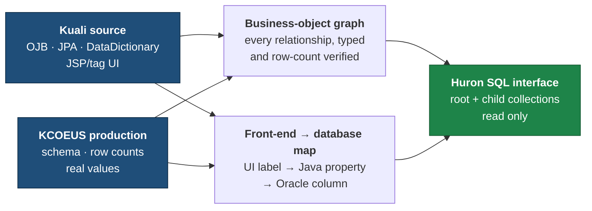

# BU Huron Data Exchange

**Purpose:** understand BU's KC Grants business objects and expose them clearly for
Huron mapping.

**Sharing this with Huron?** Point them at [HURON_START_HERE.md](HURON_START_HERE.md).

## Status

| Module | State |
|---|---|
| Award | **COMPLETE** |
| Institutional Proposal | **COMPLETE** |
| Subaward | **NEXT** |
| Negotiation | NOT STARTED |

## How it works



Nothing is inferred from table names. Every relationship, label and count is checked
against both the application source and production before it is written down.

## Where to look

| Path | Contents |
|---|---|
| `modules/award/` | Everything about Award |
| `modules/proposal/` | Everything about Institutional Proposal |
| `reference/` | Cross-module Kuali field metadata |
| `discovery/` | Broad KC schema research |
| `scripts/` | Reproducible analysis/build tooling |
| `templates/` | Generic working templates |
| `HURON_START_HERE.md` | Orientation for Huron / external consumers |

## Database access

Production is **read only**, through one controlled runner:

```bash
.venv/bin/python scripts/kc_prod_readonly_query.py --file <query.sql> --limit 20
```

It sets `SET TRANSACTION READ ONLY` and rejects anything that is not `SELECT`/`WITH`.
No DML or DDL is ever executed. No production row extracts are committed.
