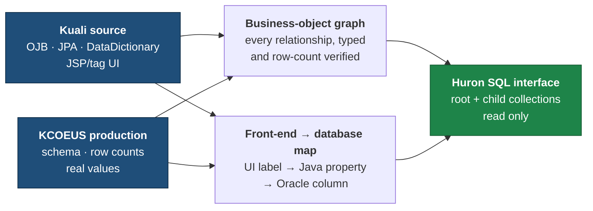

# BU Huron Data Exchange

**Purpose:** understand BU's KC Grants business objects and expose them clearly for
Huron mapping.

**Sharing this with Huron?** Start with [HURON_MAPPING_GUIDE.md](HURON_MAPPING_GUIDE.md),
then use [docs/HURON_USAGE_GUIDE.md](docs/HURON_USAGE_GUIDE.md) for the expected mapping,
extraction, loading and reconciliation workflow.

## Status

| Module | State | Business records | Physical rows |
|---|---|---|---|
| Award | Technical mapping complete · BU validation pending | 43,202 | 282,468 |
| Institutional Proposal | Technical mapping complete · BU validation pending | 36,863 | 130,122 |
| Subaward | Technical mapping complete · BU/Huron decision pending | 3,466 | 93,061 |
| Negotiation | Technical mapping complete · BU validation pending | 11,842 | 11,842 (not versioned) |

**What the states mean.** "Technical mapping complete" means the graph, the UI field
mapping and the SQL are built and verified against production — it does **not** mean the
business decisions are settled. Nothing here is approved for migration use yet.

| State | Meaning |
|---|---|
| Technical mapping complete | Graph, field mapping and SQL built and verified against production |
| BU validation pending | BU has not yet confirmed the findings are right |
| BU/Huron decision pending | Specific open questions need a joint decision — see the [decision register](docs/DECISION_REGISTER.md) |
| Approved for migration use | Signed off. Nothing has reached this yet |

Counts were measured on **2026-08-07**. Production moves; see
[docs/PROVENANCE.md](docs/PROVENANCE.md) for what each number was measured against.

## How it works



We do not infer relationships from table names. Every relationship, label and count is
checked against both the Kuali source and production before we write it down.

One thing worth knowing up front: all four business objects are versioned differently.
Award, Institutional Proposal and Subaward each needed their own rule for picking the
current row, and Negotiation is not versioned at all. Each module documents its own rule
and the exceptions behind it.

## Where to look

| Path | Contents |
|---|---|
| `modules/award/` | Everything about Award |
| `modules/proposal/` | Everything about Institutional Proposal |
| `modules/subaward/` | Everything about Subaward |
| `modules/negotiation/` | Everything about Negotiation |
| `docs/` | Cross-module data model, the SQL interface, and developer setup |
| `reference/` | Cross-module Kuali field metadata |
| `discovery/` | Broad KC schema research |
| `scripts/` | Reproducible analysis/build tooling |
| `docs/` | Cross-module docs — [walkthrough](docs/WALKTHROUGH.md), [data contract](docs/DATA_CONTRACT.md), [decision register](docs/DECISION_REGISTER.md), [provenance](docs/PROVENANCE.md), [glossary](docs/GLOSSARY.md) |
| `HURON_MAPPING_GUIDE.md` | Orientation for Huron / external consumers |

New here? [docs/DATA_MODEL.md](docs/DATA_MODEL.md) is the cross-module picture,
[docs/SQL_INTERFACE.md](docs/SQL_INTERFACE.md) explains the query datasets, and
[docs/ONBOARDING.md](docs/ONBOARDING.md) covers setup and regenerating the artifacts.

## Database access

Production is **read only**, through one controlled runner:

```bash
.venv/bin/python scripts/kc_prod_readonly_query.py --file <query.sql> --limit 20
```

It sets `SET TRANSACTION READ ONLY` and rejects anything that is not `SELECT`/`WITH`.
No DML or DDL is ever executed. No production row extracts are committed.
