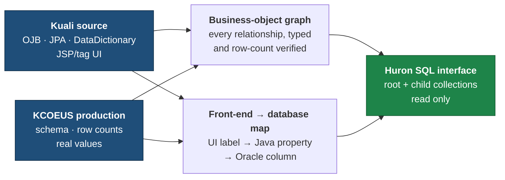

# BU Huron Data Exchange

**Purpose:** understand BU's KC Grants business objects and expose them clearly for
Huron mapping.

**Sharing this with Huron?** Start with [HURON_MAPPING_GUIDE.md](HURON_MAPPING_GUIDE.md),
then use [docs/HURON_USAGE_GUIDE.md](docs/HURON_USAGE_GUIDE.md) for the expected mapping,
extraction, loading and reconciliation workflow.

**For the upcoming BU/Huron review:**
[reference/HURON_REVIEW_ITEMS.md](reference/HURON_REVIEW_ITEMS.md)

This repository defines the source datasets. The physical Huron-to-BU
connectivity/delivery method is still to be agreed — see
[docs/HURON_CONNECTIVITY.md](docs/HURON_CONNECTIVITY.md).

## Status

| Module | State | Business records | Physical rows |
|---|---|---|---|
| Award | Technical mapping complete · BU validation pending | 43,202 | 282,468 |
| Institutional Proposal | Technical mapping complete · BU validation pending | 36,863 | 130,122 |
| Subaward | Technical mapping complete · BU/Huron decision pending | 3,466 | 93,061 |
| Negotiation | Technical mapping complete · BU validation pending | 11,842 | 11,842 (not versioned) |

**What the states mean.** "Technical mapping complete" means the graph, the UI field
mapping and the SQL are built and verified against production — it does **not** mean the
business decisions are settled. Nothing here is approved for migration use yet.

| State | Meaning |
|---|---|
| Technical mapping complete | Graph, field mapping and SQL built and verified against production |
| BU validation pending | BU has not yet confirmed the findings are right |
| BU/Huron decision pending | Specific open questions need a joint decision — see the [decision register](docs/DECISION_REGISTER.md) |
| Approved for migration use | Signed off. Nothing has reached this yet |

Counts were measured on **2026-08-07**. Production moves; see
[docs/PROVENANCE.md](docs/PROVENANCE.md) for what each number was measured against.

## How it works



We do not infer relationships from table names. Every relationship, label and count is
checked against both the Kuali source and production before we write it down.

One thing worth knowing up front: all four business objects are versioned differently.
Award, Institutional Proposal and Subaward each needed their own rule for picking the
current row, and Negotiation is not versioned at all. Each module documents its own rule
and the exceptions behind it.

## Where to go

| If you want to | Go to |
|---|---|
| Talk to Huron about mapping | [HURON_MAPPING_GUIDE.md](HURON_MAPPING_GUIDE.md) · [reference/HURON_REVIEW_ITEMS.md](reference/HURON_REVIEW_ITEMS.md) |
| Understand how Huron will receive BU data | [docs/HURON_CONNECTIVITY.md](docs/HURON_CONNECTIVITY.md) — **not decided yet** |
| Understand the data model | [docs/DATA_MODEL.md](docs/DATA_MODEL.md) |
| Understand one business object | `modules/<object>/README.md` then `modules/<object>/*_GRAPH.md` |
| Map front-end fields | [reference/KUALI_FIELD_DICTIONARY.csv](reference/KUALI_FIELD_DICTIONARY.csv) · `modules/<object>/*_FRONTEND_DATABASE_MAPPING.csv` |
| Understand or run the SQL | [docs/SQL_INTERFACE.md](docs/SQL_INTERFACE.md) · `modules/<object>/sql/` |
| Set the repo up | [docs/ONBOARDING.md](docs/ONBOARDING.md) |
| See what is still open internally | [docs/DECISION_REGISTER.md](docs/DECISION_REGISTER.md) |
| Look at the broad KC discovery | [discovery/README.md](discovery/README.md) |

Five documents carry most of the meaning, and they do different jobs:

| Document | What it is for |
|---|---|
| `README.md` | Where everything is |
| [HURON_MAPPING_GUIDE.md](HURON_MAPPING_GUIDE.md) | What Huron should understand about the package |
| [reference/HURON_REVIEW_ITEMS.md](reference/HURON_REVIEW_ITEMS.md) | What BU and Huron still need to decide together |
| [docs/DECISION_REGISTER.md](docs/DECISION_REGISTER.md) | The complete internal record of decisions and anomalies |
| `modules/*/*_GRAPH.md` | The detailed evidence behind each business object |

Also in `docs/`: a [worked walkthrough](docs/WALKTHROUGH.md) of one real award, the
[data contract](docs/DATA_CONTRACT.md), [provenance](docs/PROVENANCE.md) and a
[glossary](docs/GLOSSARY.md). Tooling lives in [scripts/](scripts/README.md).

### Where new findings go

The structure above is finished. New work belongs in one of these, rather than in a new
top-level document:

| What you found | Where it goes |
|---|---|
| A new source finding | that module's `*_GRAPH.md` |
| An internal decision or anomaly | [docs/DECISION_REGISTER.md](docs/DECISION_REGISTER.md) |
| Something needing Huron discussion | [reference/HURON_REVIEW_ITEMS.md](reference/HURON_REVIEW_ITEMS.md) |
| Partner-facing orientation | [HURON_MAPPING_GUIDE.md](HURON_MAPPING_GUIDE.md) |

## Database access

Production is **read only**, through one controlled runner:

```bash
.venv/bin/python scripts/kc_prod_readonly_query.py --file <query.sql> --limit 20
```

It sets `SET TRANSACTION READ ONLY` and rejects anything that is not `SELECT`/`WITH`.
No DML or DDL is ever executed. No production row extracts are committed.
