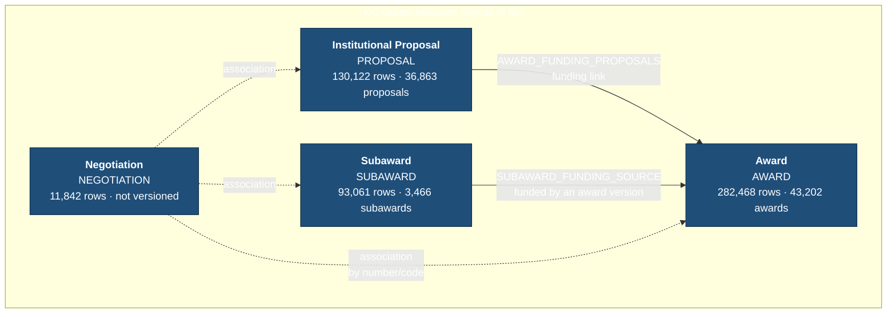
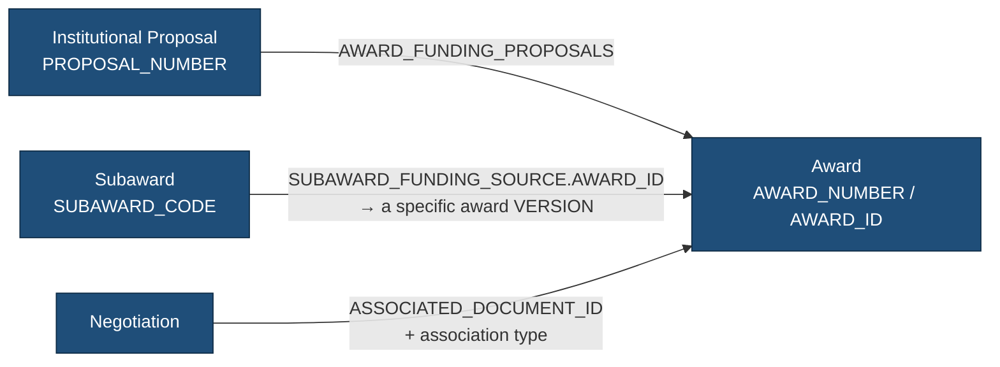
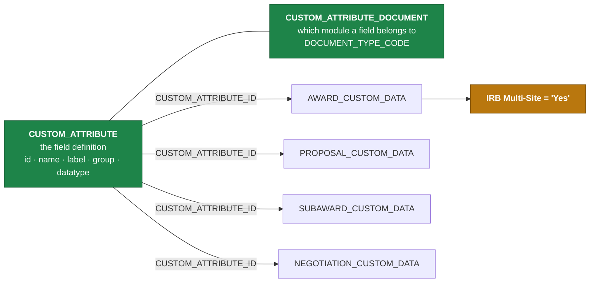
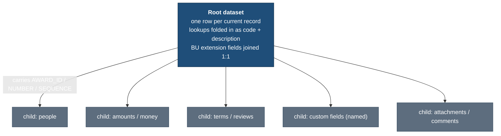

# How BU's Grants business objects fit together

This is the cross-module picture: the four KC Grants business objects BU has modelled for
Huron, how each one is versioned, and how they link to each other. Each module has its own
`*_GRAPH.md` with the full relationship list, the row counts, and the decisions behind it.
This document sits above those and connects them, so it stays deliberately short and links
out instead of repeating what the module docs already say.

If you are mapping fields, `reference/KUALI_FIELD_DICTIONARY.csv` is still the place to
start (see [HURON_MAPPING_GUIDE.md](../HURON_MAPPING_GUIDE.md)). This document is about
shape and relationships, not field-level meaning.


## Awards roll up into families

One thing the per-module docs only cover from the Award side, but which matters as soon
as you look at the whole picture: BU's awards are not flat. An **Award family** (the BU
grant family) is the root `-00001` award together with its child/subaccount awards.

```
AWARD FAMILY (one funded project)
    |
    +-- 123456-00001   root award — the family
    |
    +-- 123456-00002   award / account
    +-- 123456-00003   award / account
```

There are three levels, and confusing any two of them is the easiest mistake to make in
this data:

| Level | Key | What changes | Same record? |
|---|---|---|---|
| Award family | `ROOT_AWARD_NUMBER` | nothing — it is the grouping | — |
| Award / account | `AWARD_NUMBER` | the account | No, different awards |
| Version | `SEQUENCE_NUMBER` | one award over time | Yes, same award |

So the counts stack up like this:

```
282,468  physical AWARD rows
 43,202  award business records   (one per AWARD_NUMBER)
 15,729  Award families           (one per funded project)
```

Every family root ends in `-00001`, every award shares its root's base number, and the
subaccounts genuinely are separate accounts — 27,170 have their own `ACCOUNT_NUMBER` and
none reuses the root's. Nesting exists but is rare: `HIERARCHY_LEVEL` is 0-based, and
101 awards sit at level 2 with 3 at level 3, across 21 of the 15,729 families.

`modules/award/sql/huron_award_hierarchy.sql` is the machine-readable version, with
`IS_ROOT_AWARD`, `HIERARCHY_LEVEL`, `ROOT_AWARD_NUMBER` and `PARENT_AWARD_NUMBER`. The
full evidence is in [AWARD_GRAPH.md](../modules/award/AWARD_GRAPH.md).

This is not only a pattern we spotted in the data. BU's 2012 KCRM-SAP Grants Interface
functional specification says the parent award maps 1:1 to the SAP Grant and each child
award becomes a Sponsored Program — which is why no root award in production carries an
`ACCOUNT_NUMBER` and 27,170 children do. `BU_GRANT_NUMBER` turns out to be a
family-level identifier: no family holds more than one distinct value.

## The four business objects

BU has modelled four Grants business objects. Each one is a whole graph — a root table
plus its child collections and lookups — not a single table.



Solid lines are funding relationships that carry real business content. Dotted lines are
negotiations pointing back at whatever they are about. The counts are physical rows and
distinct business records — the gap between the two is versioning, which is the first
thing to understand about this schema.

| Business object | Root table | Primary key | Business key | Physical rows | Business records |
|---|---|---|---|---|---|
| Award | `KCOEUS.AWARD` | `AWARD_ID` | `AWARD_NUMBER` + `SEQUENCE_NUMBER` | 282,468 | 43,202 |
| Institutional Proposal | `KCOEUS.PROPOSAL` | `PROPOSAL_ID` | `PROPOSAL_NUMBER` + `SEQUENCE_NUMBER` | 130,122 | 36,863 |
| Subaward | `KCOEUS.SUBAWARD` | `SUBAWARD_ID` | `SUBAWARD_CODE` + `SEQUENCE_NUMBER` | 93,061 | 3,466 |
| Negotiation | `KCOEUS.NEGOTIATION` | `NEGOTIATION_ID` | `NEGOTIATION_ID` (one row per negotiation) | 11,842 | 11,842 |

## How versioning works, and why each object needed its own rule

Three of the four objects store many sequences of the same record. Every edit writes a new
row with a new `SEQUENCE_NUMBER`, so the physical row count is much larger than the number
of real awards, proposals or subawards. Before any of them could be exposed we had to pick
which row is the current one — and we did not assume `MAX(SEQUENCE_NUMBER)` was the answer,
because in production it isn't.

Each module worked this out separately from its own evidence, and the four answers came out
different. That is worth stating plainly, because it is the kind of thing that looks like it
should be one rule and isn't.

| Object | Rule for the current row | Why not just MAX(SEQUENCE_NUMBER) |
|---|---|---|
| Award | ACTIVE → highest sequence → highest `AWARD_ID` | 10 award numbers have two rows at the same highest sequence (one ACTIVE, one ARCHIVED) |
| Institutional Proposal | ACTIVE → highest sequence → highest `PROPOSAL_ID` | For 80 proposals the ACTIVE row is *not* the highest sequence — the row above it is CANCELED, PENDING or ARCHIVED |
| Subaward | ACTIVE → highest sequence → latest `UPDATE_TIMESTAMP` → highest `SUBAWARD_ID` | 62 subaward codes have more than one row at the highest sequence; one code even has two ACTIVE rows 92 seconds apart |
| Negotiation | none needed | There is no `SEQUENCE_NUMBER` at all and `VERSION_HISTORY` holds zero rows for the class |

Every root query prefers the row KC marks `ACTIVE` and falls back only where there is no
ACTIVE row. Each root carries a `SELECTION_RULE` column that records which branch chose the
row, so nothing is quietly deduplicated. The counts and exceptions behind each rule live in
that module's `*_latest_version_validation.sql` (Negotiation keeps a
`population_validation.sql` instead, because "we checked, and it is not versioned" is still
worth being able to re-run).

The detail for each rule is in the module docs:
[Award](../modules/award/AWARD_GRAPH.md),
[Institutional Proposal](../modules/proposal/PROPOSAL_GRAPH.md),
[Subaward](../modules/subaward/SUBAWARD_GRAPH.md),
[Negotiation](../modules/negotiation/NEGOTIATION_GRAPH.md).

## How the objects connect to each other

Three links tie the four objects together. Two of them carry a version wrinkle, so they are
worth setting out rather than leaving to be discovered during mapping.



**Proposal to Award — the funding proposal link.** An Institutional Proposal becomes an
Award through `AWARD_FUNDING_PROPOSALS`, which the Award graph exposes as a child dataset
(13,657 rows). This is the normal proposal-to-award relationship and it joins on the
proposal number.

**Subaward to Award — funded by a specific award version.**
`SUBAWARD_FUNDING_SOURCE.AWARD_ID` points at one specific `AWARD` row — a single award
*version*, not the award as a whole. That is deliberate in KC: the link records the award
version that existed when the subaward was funded. We checked what that means today, and of
the 7,930 funding rows on current subawards, 5,846 (74%) point at an award version that has
since been superseded. We kept the link exactly as KC recorded it, because the recorded
version is real history and cannot be recovered once it is replaced. To reach the current
Award root, join on the award number instead:

```sql
huron_subaward_funding_source.funding_award_number = huron_award.award_number
```

The subaward funding dataset also carries `FUNDING_AWARD_VERSION_IS_CURRENT` and
`CURRENT_AWARD_ID` so you can see at a glance whether the recorded version is still the live
one. The full check is in [SUBAWARD_GRAPH.md](../modules/subaward/SUBAWARD_GRAPH.md).

**Negotiation to everything — one column, four meanings.** A negotiation can be about an
Award, a Subaward, an Institutional Proposal, or nothing yet. `NEGOTIATION_ASSC_TYPE_ID`
says which, and `ASSOCIATED_DOCUMENT_ID` holds the key — but the meaning of that column
changes with the type.

| Association type | Negotiations | `ASSOCIATED_DOCUMENT_ID` points at |
|---|---|---|
| Award | 2,574 | `AWARD.AWARD_NUMBER` |
| Subaward | 16 | `SUBAWARD.SUBAWARD_CODE` |
| Institutional Proposal | 3 | `PROPOSAL.PROPOSAL_NUMBER` |
| None | 9,249 | nothing — detail is in `NEGOTIATION_UNASSOC_DETAIL` |

The negotiation link to Award is by `AWARD_NUMBER`, so it lands on the award as a whole
without any version question — the opposite of the subaward funding link above. Because one
column means four different things, the root query exposes `ASSOCIATED_DOCUMENT_ID_MEANS`
alongside it. Most negotiations at BU (78%) are not attached to anything yet, which is one
of the open items in [NEGOTIATION_GRAPH.md](../modules/negotiation/NEGOTIATION_GRAPH.md).

## How BU custom fields work across all four objects

Every object carries BU-configured custom fields, and they all use the same KC
custom-attribute model. This is an entity-attribute-value (EAV) design: one table holds the
field definitions and a per-module `*_CUSTOM_DATA` table holds the values.



The thing to know is that a `*_CUSTOM_DATA` row does not have a field called `VALUE`. The
business field is whichever custom attribute the row's `CUSTOM_ATTRIBUTE_ID` refers to;
`VALUE` is only generic storage. A row of `CUSTOM_ATTRIBUTE_ID = 1542, VALUE = 'Yes'` means
the field *IRB Multi-Site* is *Yes*. BU has resolved all of this before delivery, so the
`*_custom.sql` datasets present each field by its name and label rather than as an integer.

Which module a custom field belongs to comes from
`CUSTOM_ATTRIBUTE_DOCUMENT.DOCUMENT_TYPE_CODE` — the authoritative configuration — never
from the presence of a value. BU has 107 custom attributes configured:

| Document type | Module | Attributes |
|---|---|---|
| `AWRD` | Award | 46 |
| `INPR` | Institutional Proposal | 45 |
| `SAWD` | Subaward | 15 |
| `NGT` | Negotiation | 8 |
| `PRDV` | Proposal Development | 4 |
| `PROT` | Protocol / IRB (out of Grants scope) | 28 |
| *(none)* | not attached to any document type | 3 |

A few attributes have values in a module they are not configured for — attribute 1212
"Contract" is attached to no document type yet has values under both Award and Proposal.
We report those rather than discard them. Each module's `*_GRAPH.md` lists its own
custom-attribute anomalies, and the definitions are in `reference/custom-attributes/`.

## The shape every module shares

All four modules are built the same way, so once you have read one the others read quickly.



Two decisions are the same everywhere. One-to-many collections stay in their own datasets
rather than being joined onto the root — one award with 5 people, 12 terms and 40 custom
fields would otherwise come back as 2,400 duplicate award rows. Many-to-one lookups go the
other way, folded into the root as code plus description, because a lookup cannot multiply
rows. Every child dataset carries the root's lineage keys (`AWARD_ID`, `AWARD_NUMBER`,
`SEQUENCE_NUMBER`, and the equivalents for the other objects) so the graph can be
reassembled against the right version. The [SQL interface reference](SQL_INTERFACE.md)
describes the datasets one by one.

## What each object brings that the others don't

The four objects are not symmetric. A few differences are worth carrying into mapping:

- **Award** is the largest and most heavily related, especially its personnel sub-graph
  (award → person → unit → credit split, four levels). It has a BU extension table with
  ~25 fields including Grant Number and Prime Sponsor Award ID.
- **Institutional Proposal** has a separate intake object, `PROPOSAL_LOG`, that shares the
  proposal number but is not a child, plus `IP_REVIEW`, which is its own versioned object
  reached through a join.
- **Subaward** is small in record count but rich per record: the agreement terms live in
  `SUBAWARD_TEMPLATE_INFO` (48 business columns), and its type code reuses the Award type
  lookup rather than having its own.
- **Negotiation** is the only object with no version history, no BU extension table, and
  the association-type wrinkle above. Its real content is the activity log, and attachments
  hang off the activity rather than off the negotiation.

## Things we would flag at the cross-module level

Most open questions are module-specific and recorded at the end of each `*_GRAPH.md`. Two
are worth raising because they cross module boundaries:

- **Subaward funding points at superseded award versions 74% of the time.** We preserved
  the recorded version as history. Whether a load should take the recorded version or the
  current one is a migration decision, and it affects how Subaward and Award line up after
  conversion.
- **Negotiations are mostly unattached** (78%), and only 3 link to a Proposal and 16 to a
  Subaward. Those small numbers are worth a sanity check before assuming the association
  types are used the way they look.
