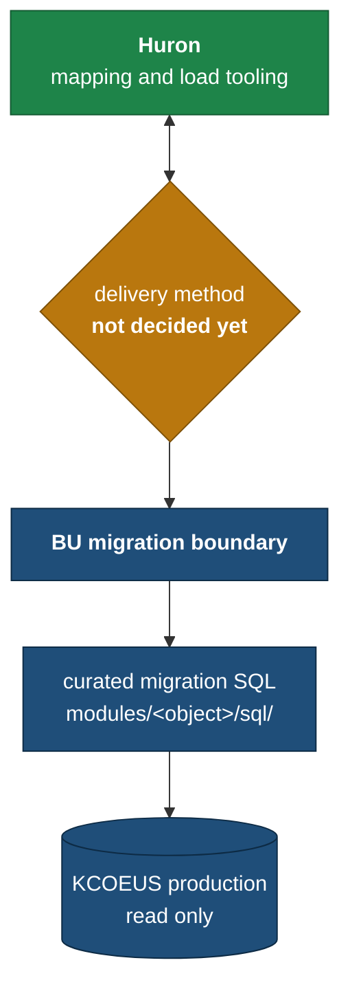

# How Huron connects to BU

The rest of this repository explains *what* data BU is exposing. This document is about
*how it gets to Huron* — and that part is not decided yet.

We think it is better to say that plainly than to leave people guessing. If you came
looking for the connection details and could not find them, this is why: BU has finished
the logical interface and has deliberately not provisioned any connectivity ahead of
agreeing the approach with Huron.

## Where the line currently sits



What is built today, and works:

```
KCOEUS production
        ↓  BU-controlled read-only SQL
Award · Institutional Proposal · Subaward · Negotiation datasets
```

What is not built: anything to the left of the BU boundary.

**One thing worth being explicit about.** The SQL in this repository does not give Huron
access to KCOEUS. Those files describe the datasets BU is prepared to expose and how they
are shaped. They are a definition, not a connection — reading them tells you what you
would receive, not how you would receive it, and nothing in this repository grants access
to anything.

## The options

These are options for discussion, not a proposal. Each has a real trade-off and the right
answer depends as much on what Huron's tooling expects as on what BU can support.

### Option A — BU runs the queries and delivers files

```
KCOEUS → BU runs curated queries → CSV / delimited files
       → approved secure transfer → Huron staging
```

The simplest security boundary: no Huron access to any BU database, and every extract is
a fixed artifact that can be archived, checksummed and reconciled against later. If a
count is ever disputed, there is an exact file to point at.

The cost is that extracts are a moment in time. Every migration cycle — mock conversions,
rehearsals, cutover — needs a fresh run and a fresh transfer.

### Option B — Read-only database access to curated views

```
KCOEUS → BU-controlled migration views → dedicated read-only account
       → approved network path → Huron tooling
```

Huron queries directly, so there is no extract-and-ship cycle and the data is always
current.

It is also the heaviest option to set up. It would need dedicated read-only credentials
scoped to the migration views only, least-privilege grants, an approved BU network path,
source connectivity details from Huron, BU security approval, agreed audit and logging,
and a decision about which environment is on the other end.

To be direct about one point: this would never mean sharing the KCOEUS application
account. Any direct access would be a purpose-built account that can read the migration
views and nothing else.

### Option C — A BU-controlled staging schema

```
KCOEUS → BU extraction → migration staging schema → Huron read-only access
```

A middle path. Huron gets table-and-SQL access, which suits tooling that wants to query
rather than parse files, but never touches the live KC application schema. BU controls
what lands in staging and when it refreshes, so a heavy Huron query cannot affect the
production system researchers are using.

It costs a database or schema to own and a refresh process to run.

### Option D — API or managed transfer

BU runs the extraction and exposes the results through an approved API, an
object-storage location, managed file transfer, or something else agreed with Huron.

We have not built any of this and are not assuming it exists. It is here because it may
be what Huron's tooling already expects, and that would be worth knowing early.

## Where BU stands

BU has completed the logical source interface. The physical delivery method should be
agreed with Huron before BU provisions connectivity.

We are not making an infrastructure commitment in this repository, and we would rather
not build a delivery mechanism that turns out to be the wrong shape for Huron's tooling.

**The module SQL is the contract either way.** These are the definitions:

- `modules/award/sql/`
- `modules/proposal/sql/`
- `modules/subaward/sql/`
- `modules/negotiation/sql/`

Whether the results reach Huron as files, as staging tables or through a direct read-only
connection should not change what any column means. The delivery decision is about
transport, not about the data — see [DATA_CONTRACT.md](DATA_CONTRACT.md) for what the
datasets guarantee regardless of how they arrive.

## What we need from Huron

**1. What does the mapping tooling prefer as a source?** Files, database tables or views,
API payloads, or something else it already supports well?

**2. If database connectivity is preferred:**

- Which database technologies and drivers are supported?
- Does Huron initiate the connection, or does BU push data outward?
- What source IP addresses or network ranges would BU need to allow?
- Which authentication methods are supported?
- Is persistent access needed, or access only during migration windows?

**3. If files are preferred:**

- What format, and what delimiter and encoding conventions?
- What are the encryption requirements, at rest and in transit?
- Which secure transfer method?
- Are there file-size limits worth knowing before we generate anything?
- Any naming or layout conventions the tooling expects?

**4. What does Huron need over the life of the project?** Current datasets only, repeated
mock-conversion extracts, the production cutover extract, or all three? The answer changes
how much of this needs to be repeatable rather than one-time.

**5. Does Huron need production directly, or would a BU-owned staging or reporting copy
meet the requirement?** This one has the largest effect on how long provisioning takes on
the BU side, so an early answer helps.

## The BU security boundary today

Stating the current position, since it shapes what is realistic:

- The production query tooling in this repository is BU-internal.
- Production access is read-only, through a single controlled runner that rejects
  anything other than `SELECT` and `WITH`.
- No credentials are stored in Git. The runner reads its password from the local macOS
  Keychain.
- No production row extracts are committed. The repository holds SQL definitions,
  schema metadata and counts.
- **No Huron database account, network path or transfer mechanism has been provisioned
  by this repository.** Nothing here creates access for anyone.

Specific network rules, credentials and internal security configuration are deliberately
not in this repository. They are not needed for the design conversation, and this document
is the wrong place for them.

## Related

| Document | For |
|---|---|
| [HURON_MAPPING_GUIDE.md](../HURON_MAPPING_GUIDE.md) | What BU prepared and how it is organised |
| [reference/HURON_REVIEW_ITEMS.md](../reference/HURON_REVIEW_ITEMS.md) | This and the other open joint decisions (D-18) |
| [SQL_INTERFACE.md](SQL_INTERFACE.md) | How the query datasets are structured |
| [DATA_CONTRACT.md](DATA_CONTRACT.md) | What the datasets guarantee |
