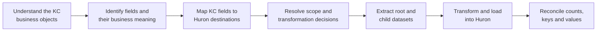

# How Huron can use this repository

This repository is a source-data interpretation and migration-design package. It explains
what BU's Kuali Coeus (KC) Grants data means, how the records fit together, which versions
represent the current business objects, and how those records can be extracted safely.

It is **not** a finished Huron loader or a final statement of migration scope. Huron can use
the material here to build and review the source-to-target mapping, transformations, load
files or API payloads, and reconciliation tests. BU and Huron still need to approve the
business decisions recorded in the [decision register](DECISION_REGISTER.md).

## The expected workflow



The work is iterative. A mapping question may reveal a data-quality issue or an unresolved
business rule, which should return to BU for review before Huron treats the mapping as
approved.

## 1. Understand each business object

Start with the [cross-module data model](DATA_MODEL.md), then open the relevant module:

| Business object | Module | What Huron should learn there |
|---|---|---|
| Award | `modules/award/` | Award versions, people, amounts, terms, reviews, custom fields and related objects |
| Institutional Proposal | `modules/proposal/` | Proposal versions, proposal-log relationships, reviews, people and custom fields |
| Subaward | `modules/subaward/` | Subaward versions, funding Award links, contacts, amounts, template information and custom fields |
| Negotiation | `modules/negotiation/` | Association types, activities, attachments, unassociated details and custom fields |

For each module, the Markdown graph explains the model and its exceptions; the graph CSV
provides the same relationships in machine-readable form. Huron should use these
relationships instead of inferring joins from similar table or column names.

### Important versioning note

Award, Institutional Proposal and Subaward retain multiple physical versions of the same
business record. Each uses a different rule for identifying its current version.
Negotiation is not versioned. Huron should reuse the version-selection logic in the supplied
SQL rather than introducing a generic `MAX(SEQUENCE_NUMBER)` rule.

## 2. Translate database fields into business concepts

The main cross-module resource is `reference/KUALI_FIELD_DICTIONARY.csv`. It connects:

```text
Oracle table and column
        -> Java business object and property
        -> label shown in the KC user interface
        -> lookup used to decode the value
        -> field origin, mapping priority and confidence
```

The module-specific `*_FRONTEND_DATABASE_MAPPING.csv` files provide a narrower view for
each business object. Huron can use them to distinguish among:

- fields displayed to BU users;
- technical identifiers needed for lineage;
- coded values that require lookup descriptions or crosswalks;
- BU extensions and locally configured custom attributes; and
- fields for which the available evidence was not strong enough to assert a UI label.

A UI label should not be derived from the database column name. For example,
`AWARD.AWARD_NUMBER` is presented to users as "Award ID." The supplied mapping records
that distinction and cites the application source used to establish it.

## 3. Build the source-to-target mapping

Huron can combine the field dictionary, frontend mapping, data model and its target schema
to create a source-to-target mapping workbook. At minimum, each mapping decision should
record:

| Mapping element | Example of the decision being captured |
|---|---|
| KC source | Table, column or supplied SQL output column |
| Business meaning | The concept BU users associate with the field |
| Huron destination | Target object and field |
| Transformation | Direct copy, formatting, split, concatenation, derivation or default |
| Value crosswalk | Translation from a KC code to a Huron value |
| Cardinality | One value, repeating child collection or conditional association |
| Null handling | Preserve null, default it, reject it or route it for review |
| Scope | Migrate, retain only for reference or exclude |
| Evidence | Field dictionary, source file, graph finding or approved decision |
| Approval | BU and Huron reviewer and decision date |

Not every KC field needs a one-to-one destination. Technical columns may be retained only
for reconciliation, while a BU custom attribute may require Huron configuration before it
can be loaded.

## 4. Resolve migration decisions

The repository documents observed data; it does not silently turn uncertain findings into
business rules. Huron and BU should review [DECISION_REGISTER.md](DECISION_REGISTER.md)
before finalizing mappings or transformation code.

Typical decisions include:

- whether a related object should retain its recorded historical link or be connected to
  the current version;
- whether legacy, incomplete or unassociated records are in migration scope;
- how unused, blank or unexpectedly configured custom fields should be treated; and
- whether low-volume relationship types reflect valid business activity or data issues.

An unresolved item can be explored in a prototype, but it should not be represented as an
approved migration rule.

## 5. Extract the source datasets

The module `sql/` directories contain read-only queries described in
[SQL_INTERFACE.md](SQL_INTERFACE.md). Each module normally exposes:

- one root dataset with one row per selected current business record;
- separate datasets for repeating children such as people, amounts, terms or activities;
- a custom-field dataset with the custom-attribute definition beside its value; and
- validation queries that demonstrate the population and version-selection results.

Keeping child collections separate avoids Cartesian multiplication. If one Award has five
people, twelve terms and forty custom fields, combining all three collections in one flat
join could produce 2,400 rows for that Award. The supplied interface preserves the original
collection grain.

### Lineage and reassembly

Each child row carries the root identifiers needed to attach it to the correct business
record and version. Huron should retain these keys through staging and transformation,
even when the keys will not become user-facing Huron fields. They are essential for:

- grouping children under the correct parent;
- preventing children from different versions from being mixed;
- tracing a Huron record back to its KC source; and
- explaining count or value differences during reconciliation.

## 6. Transform and load

After the mappings and decisions are approved, Huron can use the extracted datasets to
produce its required load representation. Depending on the agreed implementation, that
could be delimited files, staged relational tables, API payloads or another Huron-supported
format.

Transformation logic should remain traceable to a mapping decision. Useful categories are:

- **Direct:** carry the source value without changing its meaning.
- **Crosswalk:** translate a KC code into the approved Huron code.
- **Lookup:** replace or supplement a code with its description or target identifier.
- **Derived:** compute a target value from one or more source fields.
- **Conditional:** choose a target or relationship according to a type or status.
- **Defaulted:** supply an approved value when the source is absent.
- **Excluded:** deliberately omit a field or record, with the reason documented.

The Negotiation `ASSOCIATED_DOCUMENT_ID` is an important conditional example: its meaning
depends on the association type, so the same source column can identify an Award, Subaward,
Institutional Proposal or no associated document.

## 7. Validate and reconcile

Validation should happen at several levels rather than relying on one total row count.

| Validation level | Suggested checks |
|---|---|
| Source population | Root counts agree with the version-validation queries |
| Uniqueness | Root business keys occur once under the approved selection rule |
| Relationships | Child parent keys resolve; expected orphan counts are explained |
| Preservation | Extracted child counts agree with their source populations |
| Transformation | Crosswalks resolve and required target values are populated |
| Load | Accepted, rejected and skipped rows account for the complete extract |
| Business review | Sample records display the expected values and relationships in Huron |

Counts in the documentation are evidence from a particular production observation, not
permanent acceptance totals. Use [PROVENANCE.md](PROVENANCE.md) to identify when the
published counts were measured, and record fresh extract counts for every migration cycle.

For record-level testing, choose examples that exercise more than the normal path:

- a record with multiple versions;
- a record selected through a fallback version rule;
- a record with several child collections;
- a BU extension field and a custom attribute;
- a null or unresolved lookup;
- a historical or exceptional relationship; and
- each applicable Negotiation association type.

## Suggested division of responsibility

The project may assign responsibilities differently, but the following split makes the
expected handoffs explicit:

| Activity | BU | Huron | Joint |
|---|---:|---:|---:|
| Explain BU business meaning and historical practice | Lead | Consult | |
| Confirm KC source relationships and observed values | Lead | Review | |
| Define the Huron target field and supported load method | Consult | Lead | |
| Approve scope, crosswalks and exception handling | | | Lead |
| Implement target transformations and load processing | Consult | Lead | |
| Validate representative records in the Huron application | | | Lead |
| Approve reconciliation and migration readiness | | | Lead |

## What Huron should produce from this material

The repository should help Huron produce these migration deliverables:

1. An approved source-to-target mapping for each module.
2. Approved code and reference-data crosswalks.
3. A resolved decision register or an explicit list of deferred items.
4. Extraction and transformation specifications tied to repository evidence.
5. Load files or payloads in the agreed Huron format.
6. Reconciliation results covering roots, children, exceptions and rejected rows.
7. Record-level BU acceptance evidence for representative scenarios.

## Common mistakes to avoid

- Do not equate "technical mapping complete" with approval for migration use.
- Do not select current records with one generic version rule across all modules.
- Do not flatten several one-to-many collections into one extract.
- Do not use a UI label, database name or Java property as though the three are always the
  same.
- Do not discard technical lineage keys before reconciliation is complete.
- Do not assume every custom attribute is active, populated or in migration scope.
- Do not treat documented production counts as timeless totals.
- Do not resolve a business ambiguity only in transformation code; record and approve the
  decision first.

## Recommended reading order for Huron

1. [HURON_MAPPING_GUIDE.md](../HURON_MAPPING_GUIDE.md) — repository orientation.
2. [DATA_MODEL.md](DATA_MODEL.md) — cross-module relationships and versioning.
3. This guide — how to apply the material during migration work.
4. [SQL_INTERFACE.md](SQL_INTERFACE.md) — extract shapes, lineage and query inventory.
5. The relevant `modules/<name>/README.md` and `*_GRAPH.md`.
6. `reference/KUALI_FIELD_DICTIONARY.csv` and the module frontend mapping CSV.
7. [DECISION_REGISTER.md](DECISION_REGISTER.md) — items requiring agreement.
8. [PROVENANCE.md](PROVENANCE.md) — observation dates and artifact provenance.

