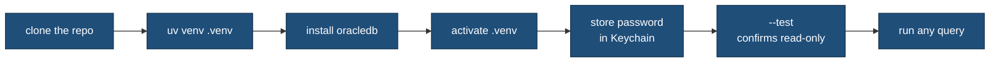
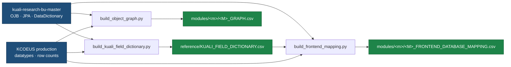

# Setting up and regenerating this repo

This is the internal setup guide — how to get the database runner working and how to rebuild
the generated artifacts. It is written for a BU developer picking the repo up, so it is
blunter than the partner-facing docs. If you only need to understand the data, start with
the [root README](../README.md) and [DATA_MODEL.md](DATA_MODEL.md) instead.

## What you need first

- **macOS.** The database runners read the Oracle password from the macOS Keychain using
  the `security` command. On another OS you would need to change how `get_password()` works
  in the two runner scripts.
- **[uv](https://github.com/astral-sh/uv)** for the Python environment. The runners print
  `uv` commands in their own error messages, so that is the supported path.
- **Network access to the BU database hosts.** Production is
  `prod.db.kuali.research.bu.edu` and staging is `stg.db.kualitest.research.bu.edu`, both on
  port 1521. If you cannot reach those hosts the runner will fail at connect time.
- **The KCOEUS read-only password.** You get this from whoever owns BU's Kuali database
  access — it is not in the repo and never should be.

## The one-time setup



Create the virtual environment and install the Oracle driver:

```bash
uv venv .venv
uv pip install --python .venv/bin/python oracledb
```

`oracledb` (python-oracledb) is the only hard dependency of the runners. There is no pinned
requirements file in the repo yet — if you add more tooling, that is worth fixing.

Activate it for the rest of your session:

```bash
source .venv/bin/activate
```

Your prompt picks up a `(.venv)` prefix once it works, and plain `python` is then the
right interpreter. **Everything below assumes the environment is active.**

You can skip activation entirely by calling `.venv/bin/python` instead of `python` — same
result, and that is the form most of the other documents in this repo use because it works
from any shell without setup. Use whichever you prefer; the two are interchangeable.

Store the passwords in the Keychain. Production and staging use different Keychain entries,
so set up whichever you need.

Production:

```bash
security add-generic-password -U -a "KCOEUS" -s "bu-kuali-prod-readonly" -w
```

Staging (there is a helper script that prompts for the password so it never lands in your
shell history):

```bash
scripts/setup_kc_staging_keychain.sh
```

## Check the connection

Both runners have a `--test` mode that connects, sets the transaction read-only, and prints
which database and schema it landed on. Run this before anything else:

```bash
python scripts/kc_prod_readonly_query.py --test
```

It should report `Database: KUALI`, the current schema, and `Mode: READ ONLY`. If the
password isn't in the Keychain, the runner tells you the exact `security` command to fix it.

## Running a query

Point the runner at a SQL file, or pass SQL inline. `--limit` caps the rows; `--output`
writes a CSV instead of printing to the screen.

```bash
# one of the module queries, first 20 rows to the screen
python scripts/kc_prod_readonly_query.py --file modules/award/sql/huron_award.sql --limit 20

# inline
python scripts/kc_prod_readonly_query.py --sql "SELECT COUNT(*) FROM kcoeus.award"

# write a full result to CSV
python scripts/kc_prod_readonly_query.py --file modules/award/sql/huron_award.sql --output /tmp/award.csv
```

Staging works the same way through `scripts/kc_staging_query.py`.

### When you are done

```bash
deactivate
```

That returns your shell to the system Python. Nothing needs cleaning up on the database
side — the runner opens a read-only transaction per query and closes it.

## What "read only" actually means here

The runner is not just trusting you to write `SELECT`. It enforces read-only in two ways,
and it is worth knowing so you don't fight it:

- It rejects anything that does not start with `SELECT` or `WITH`, and it blocks the
  modifying keywords (`INSERT`, `UPDATE`, `DELETE`, `MERGE`, `DROP`, `TRUNCATE`, `CREATE`,
  `ALTER`, `GRANT`, `REVOKE`). If you try one it exits with a safety error and runs nothing.
- On the database side it issues `SET TRANSACTION READ ONLY` before your query, so even a
  statement that slipped past the keyword check could not write.

One thing that catches people out: the keyword check splits the whole file on whitespace,
so it does not know the difference between SQL and a comment. A `.sql` file whose header
comment contains the bare word `grant` — or `create`, or `update` — is rejected before it
reaches the database, even though the query itself is a plain `SELECT`. Two consequences
worth knowing:

- Prose in SQL comments has to work around it. Write `award family` rather than the other
  phrase, or attach punctuation (`grant,` is a different token and passes). This is also
  why the module SQL files keep their explanatory comments in a footer rather than a
  header — the runner needs the first statement to start with `SELECT` or `WITH`.
- It is a blunt check on purpose. We would rather it reject a harmless comment than try to
  parse SQL and get it subtly wrong.

No script opens its own database connection — everything goes through these two runners. If
you write a new analysis script, have it call the runner or import `connect()` from it
rather than wiring up a fresh connection, so the read-only guarantee stays in one place.

## Regenerating the metadata artifacts

The SQL query files are hand-written. The CSV artifacts that describe each module are
generated, and you should regenerate them rather than editing them by hand.



All three builders read BU's application fork (`kuali-research-bu-master`, branch
`bu-master`, read-only) and cross-check against production. The field dictionary comes
first, because the frontend mapping builder consumes it.

```bash
# The end-to-end field dictionary (Oracle -> Java -> Kuali UI label)
.venv/bin/python scripts/build_kuali_field_dictionary.py   # -> reference/KUALI_FIELD_DICTIONARY.csv

# Per-module object graph (relationships + production row counts)
.venv/bin/python scripts/build_object_graph.py --module award \
    --source ~/Downloads/kuali-research-bu-master \
    --row-counts <row-counts.csv> \
    --output modules/award/AWARD_GRAPH.csv

# Per-module UI -> database field mapping
.venv/bin/python scripts/build_frontend_mapping.py --module award \
    --source ~/Downloads/kuali-research-bu-master \
    --dictionary reference/KUALI_FIELD_DICTIONARY.csv \
    --custom-attributes <catalog.csv> --prod-columns <columns.csv> \
    --output modules/award/AWARD_FRONTEND_DATABASE_MAPPING.csv
```

`build_object_graph.py` and `build_frontend_mapping.py` are generic — you pick the module
with `--module`, and adding a new one means adding an entry to the `MODULES` table in each
builder. The single-module Award builders that used to exist have been retired; their
history is in Git. `scripts/README.md` has the per-script detail, including what the
`<row-counts.csv>`, `<catalog.csv>` and `<columns.csv>` inputs are.

## Rebuilding the discovery package

The broad `discovery/` sweep is separate tooling — it answered "what is in KC?" once, and it
is not part of the per-module Huron interface. The metadata under `discovery/` (data
dictionary, table manifest, exclusions, extract log) is tracked in Git. The actual row
extracts are not.

```bash
.venv/bin/python scripts/extract_grants_package.py \
    --manifest discovery/02_table_manifest.csv \
    --dictionary discovery/01_data_dictionary.csv \
    --out-root discovery/output --sql-root discovery/sql/package

.venv/bin/python scripts/validate_grants_package.py   # structure, counts, PII redaction, lineage keys
```

## Data safety and what never gets committed

`discovery/output/` holds real KCOEUS rows — PII redacted, but still institutional data —
and it is fully gitignored. So are `data/`, `exports/`, `downloads/`, `.env` files, and
anything matching `credentials`, `*.pem` or `*.key`. Before you commit, check you are not
adding a production extract or a credential. The whole point of the runner design is that
secrets live in the Keychain and row data stays out of the repo, so keep it that way.

If you hit an Oracle error while running a query, the CLAUDE.md "Oracle Awareness" section
covers how we document and correct those — start from a concrete record and trace it, don't
guess.

## Where things live

`scripts/README.md` documents every script. The [root README](../README.md) has the repo
map. Each `modules/<name>/README.md` covers that business object, and its `*_GRAPH.md` has
the relationships and decisions. [SQL_INTERFACE.md](SQL_INTERFACE.md) describes the query
datasets, and [DATA_MODEL.md](DATA_MODEL.md) is the cross-module picture.
