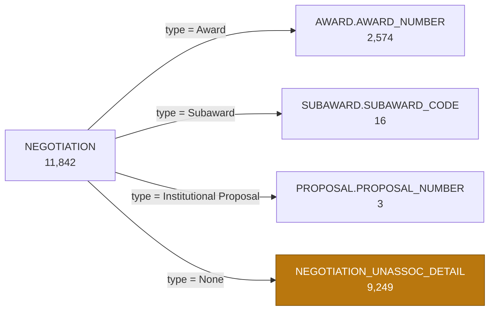

# Negotiation

## The root object

`org.kuali.kra.negotiations.bo.Negotiation` maps to `KCOEUS.NEGOTIATION` — 11,842 rows.
The primary key is `NEGOTIATION_ID`. There is only one class mapped to that table and it
has the DataDictionary entry, so there was no root-class question here.

Negotiation is much smaller than the other three business objects: 16 columns, 4
references, 3 collections. `NEGOTIATION_GRAPH.csv` has **15 relationships, 12 exposed,
3 excluded**.

## Negotiation is not versioned

This is the headline finding, and it is the opposite of what the other three modules
needed.

Award, Institutional Proposal and Subaward all store many sequences of the same business
record, and each one needed its own rule for picking the current row. Negotiation stores
one row per negotiation:

| Check | Result |
|---|---|
| Rows in `NEGOTIATION` | 11,842 |
| Distinct `NEGOTIATION_ID` | 11,842 |
| Distinct `DOCUMENT_NUMBER` | 11,842 |
| Rows in `VERSION_HISTORY` for the Negotiation class | **0** |

There is no `SEQUENCE_NUMBER` column and no sequence-status column on `NEGOTIATION`. KC
tracks version history for the other three classes and holds nothing at all for this
one.

So there is no `huron_negotiation_latest_version_validation.sql` in this module. We kept
`huron_negotiation_population_validation.sql` instead, because "we checked, and it is
not versioned" is worth being able to re-run later.

Across the four Grants business objects that now makes four different answers to "which
row is the current one":

| Module | Rule |
|---|---|
| Award | ACTIVE → highest sequence → highest `AWARD_ID` |
| Institutional Proposal | ACTIVE → highest sequence → highest `PROPOSAL_ID` |
| Subaward | ACTIVE → highest sequence → latest `UPDATE_TIMESTAMP` → highest `SUBAWARD_ID` |
| Negotiation | none needed |

## What a Negotiation is attached to

A negotiation can be about an existing Award, Subaward or Institutional Proposal, or
about nothing yet. `NEGOTIATION_ASSC_TYPE_ID` says which, and `ASSOCIATED_DOCUMENT_ID`
holds the key — but **the meaning of that column changes depending on the type**.

We checked every row against the parent its type implies, and all of them resolve:

| Association type | Negotiations | `ASSOCIATED_DOCUMENT_ID` points at | Matched |
|---|---|---|---|
| Award | 2,574 | `AWARD.AWARD_NUMBER` | 2,574 |
| Subaward | 16 | `SUBAWARD.SUBAWARD_CODE` | 16 |
| Institutional Proposal | 3 | `PROPOSAL.PROPOSAL_NUMBER` | 3 |
| None | 9,249 | nothing — detail is in `NEGOTIATION_UNASSOC_DETAIL` | 9,249 |

Because a single column means four different things, the root query exposes
`ASSOCIATED_DOCUMENT_ID_MEANS` alongside it, so nobody has to work that out from the
type id.

Two things worth noticing in those numbers. Most negotiations at BU — 78% of them — are
not attached to anything yet. And `ASSOCIATED_DOCUMENT_ID` is populated on all 11,842
rows even for the None type, where it is an internal reference rather than a business
key, so it should not be joined blindly.

Note the Award link here is by `AWARD_NUMBER`, not `AWARD_ID`. Unlike Subaward funding
sources, a negotiation points at the award as a whole rather than at one version of it,
so it lands directly on the Award root without any version question.

## Negotiations that are not attached to anything

For the 9,249 with association type None, the real content lives in
`NEGOTIATION_UNASSOC_DETAIL` — title, PI, lead unit, sponsor, prime sponsor, sponsor
award number, and the subrecipient organization when it is heading toward a subaward.

That table is 1:1 on `NEGOTIATION_ID` (9,270 rows, 9,270 distinct ids), so we folded it
into the root rather than making it a child dataset. Those columns come back NULL for
the 2,593 negotiations that *are* attached to something, which is expected.

KC does not declare this as a collection on `Negotiation` — it navigates it through
`NegotiationService` — so we added it to the graph explicitly rather than letting it be
missed.

## Activities

The actual negotiation history is the activity log: 30,475 rows across the 11,842
negotiations, each with a type, a location, dates, a follow-up date and a free-text
description.

Attachments hang off the **activity**, not off the negotiation — 32,643 of them. The
attachment dataset joins back through `NEGOTIATION_ACTIVITY` so every row still carries
its `NEGOTIATION_ID`.

`NEGOTIATION_LOCATION` has only 12 rows, and `NEGOTIATION_ACTIVITY_TYPE` 20.

## BU custom fields

8 attributes are configured for `NGT`, and the same 8 are in use. Nothing is populated
that is not attached, and no row points at a missing definition. Two of the 8 have rows
but no non-NULL value anywhere.

There is no BU extension table for Negotiation. Award, Institutional Proposal and
Subaward each have one (`*_EXTENSION`, `edu.bu` classes); Negotiation does not, so
everything BU-specific here is a custom attribute.

> `NEGOTIATION_CUSTOM_DATA` has a `NEGOTIATION_NUMBER` column that is **NULL on all
> 94,736 rows**. It is dead — join on `NEGOTIATION_ID`. This is not the same kind of
> problem as `PROPOSAL_LOG.INST_PROPOSAL_NUMBER`, which held real-looking values that
> matched nothing; this one is simply empty.

## Excluded relationships

| Relationship | Why |
|---|---|
| `negotiationDocument` | KEW workflow routing header — platform plumbing |
| `negotiationNotifications` | notification send log, and 0 rows anyway |
| 1 × `MANY_TO_ONE_INVERSE` | activity pointing back at its negotiation; the dataset already carries the id |

## Things we still need to confirm

- 78% of negotiations are not associated with an Award, Proposal or Subaward. Is that
  expected at BU, or does it point at negotiations that were never linked back after the
  award came in?
- Two NGT custom attributes have rows but no values anywhere.
- Only 3 negotiations are associated with an Institutional Proposal and 16 with a
  Subaward. Those are small enough numbers to be worth a sanity check with the office.
