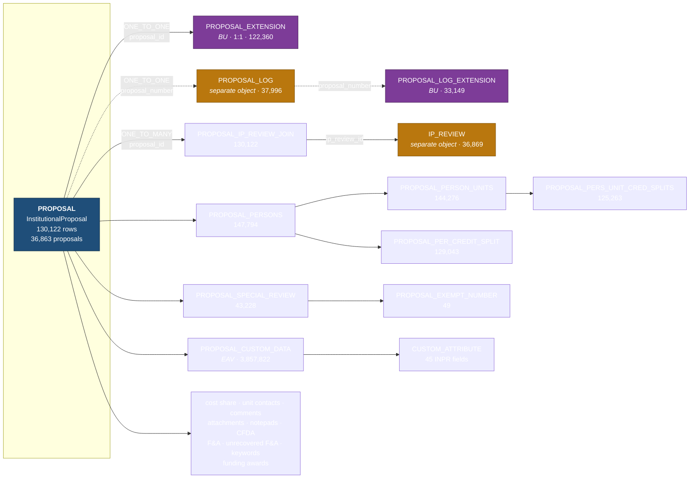
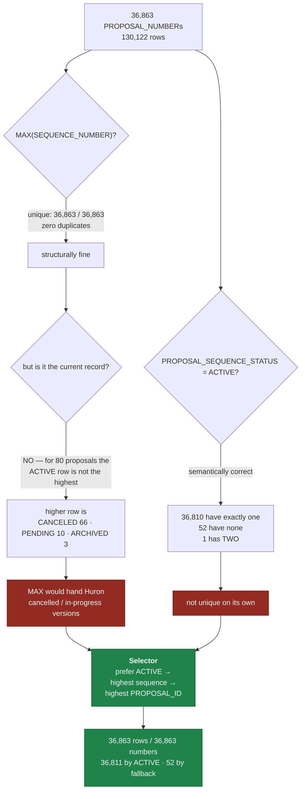
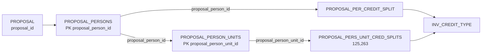
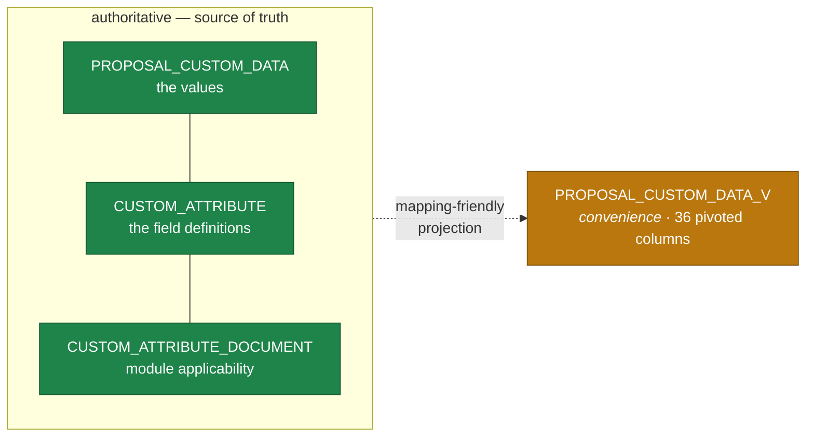

# KC Institutional Proposal Business-Object Graph

## Root object

| | |
|---|---|
| Java class | `org.kuali.kra.institutionalproposal.home.InstitutionalProposal` |
| Root table | `KCOEUS.PROPOSAL` (53 columns, 130,122 rows) |
| Primary key | `PROPOSAL_ID` |
| Business key | `PROPOSAL_NUMBER` + `SEQUENCE_NUMBER` |

Derived from the OJB descriptors in `repository-institutionalproposal.xml`, resolved to
real KCOEUS tables and annotated with production row counts.
Built by `scripts/build_object_graph.py --module proposal`.
Machine-readable form: `PROPOSAL_GRAPH.csv` — **64 relationships, 50 exposed, 14 excluded**.

## InstitutionalProposal vs InstitutionalProposalBoLite

`PROPOSAL` is mapped by **two** OJB class-descriptors. This matters: picking the wrong
one produces a graph missing 14 of 15 collections.

| | `InstitutionalProposal` | `InstitutionalProposalBoLite` |
|---|---|---|
| Fields | 53 | 22 |
| References | 11 | 4 |
| Collections | **15** | 1 |
| DataDictionary entry | **yes** | none |
| Used by | the Institutional Proposal UI and document | `AwardFundingProposal`, `AwardDocument`, Elasticsearch serializers |

`InstitutionalProposal` is the business-object root. `BoLite` is a deliberate
lightweight projection for cases where an Award or the search index needs to reference
a proposal without loading its full graph — it is **not** a competing root and must not
be used to derive the graph.

## Graph shape

Dotted lines are relationships KC navigates outside the ORM (shared business key).
Purple = BU-authored. Orange = separate business object, not a child.

## Population rule — the inverse of Award

Award's selector was **not** reused. The evidence points the other way:

Proved by `sql/huron_proposal_latest_version_validation.sql`. `SELECTION_RULE` records
which branch chose each row — nothing is silently deduplicated.

## The four relationships that needed investigation

### 1. `PROPOSAL_EXTENSION` — ONE_TO_ONE, but the ORM said otherwise

The graph builder first typed this `MANY_TO_ONE`. The cause was **not** a modelling
question: BU's fork declares the table as `table="PROPOSAL_EXTENSION "` — with a
**trailing space** — the only such typo in the entire source. Every lookup keyed on
table name missed, so no row count resolved and the 1:1 test could not fire.

Fixed by stripping whitespace in the OJB parser, then confirmed against production
rather than assumed:

| Check | Result |
|---|---|
| rows / distinct `PROPOSAL_ID` | 122,360 / 122,360 — unique |
| extension rows with no parent proposal | 0 |
| proposals with no extension row | 7,762 — so the relationship is **optional** |
| `PROPOSAL` LEFT JOIN `PROPOSAL_EXTENSION` | 130,122 rows — no multiplication |

**ONE_TO_ONE (optional).** All six BU fields carry real signal — 120,947 rows populated
for the four indicators, 48,396 and 15,885 for the two F&A rates — so the whole
extension is exposed.

### 2. `PROPOSAL_PERS_UNIT_CRED_SPLITS` — three levels down

It was absent because the graph builder only expanded two levels. Fixed
(`MAX_DEPTH = 2`, i.e. three levels of object). Same name-mismatch trap as Award: the
Java property is `institutionalProposalContactId`, the column is `PROPOSAL_PERSON_ID`.

### 3. `PROPOSAL_LOG` — a separate object sharing the business key

Not a child. `ProposalLog` has its own table, its own primary key (`PROPOSAL_NUMBER`),
its own BU extension, and **no OJB relationship in either direction**. It is the
**intake record**: created when a proposal is first logged (deadline, log status, PI
and sponsor as first captured), and it keeps the same `PROPOSAL_NUMBER` when it becomes
an Institutional Proposal.

| Check | Result |
|---|---|
| rows / distinct `PROPOSAL_NUMBER` | 37,996 / 37,996 |
| proposal numbers that have a log | **36,860 of 36,863** |
| logs that never became a proposal | 1,136 |
| LEFT JOIN selected roots → log | 36,863 — no multiplication |
| `PROPOSAL_LOG_EXTENSION` (BU) | 33,149 / 33,149, 1:1 |

**Exposed** as `ONE_TO_ONE` on `PROPOSAL_NUMBER` — the intake data is business content
Huron may want, and it cannot multiply the root.

> **`INST_PROPOSAL_NUMBER` is a trap.** 30,646 log rows populate it and it looks like
> the link to the Institutional Proposal. It is a **7-character legacy identifier** and
> matches **zero** `PROPOSAL.PROPOSAL_NUMBER` values (which are 8 characters), even
> after trimming leading zeros. Do not join on it. Reported for BU to explain, not
> resolved here.

### 4. `IP_REVIEW` — a separate versioned object reached through a join

`IntellectualPropertyReview` is its own business object: own primary key
(`IP_REVIEW_ID`), and its own `PROPOSAL_NUMBER` + `SEQUENCE_NUMBER` +
`IP_REVIEW_SEQUENCE_STATUS` (`ACTIVE`/`ARCHIVED`) — it is versioned in its own right.
`PROPOSAL_IP_REVIEW_JOIN` links it to each proposal version.

| Check | Result |
|---|---|
| `IP_REVIEW` rows / distinct `PROPOSAL_NUMBER` | 36,869 / 36,863 |
| join rows / distinct `PROPOSAL_ID` / distinct `IP_REVIEW_ID` | 130,122 / 130,122 / 36,869 |
| max reviews joined to one `PROPOSAL_ID` | **1** |
| selected roots having a review | 36,863 — 100% |

So in practice: **one review per proposal number, joined to every proposal version.**
Because the maximum is 1 per proposal version it *could* be folded into the root without
multiplying rows — but it is a distinct object with its own versioning, so it is exposed
as its own dataset carrying the proposal keys.

## Excluded relationships

| Relationship | Reason |
|---|---|
| `institutionalProposalDocument` | KEW workflow routing header — platform infrastructure |
| `allFundingProposals` | duplicate of `awardFundingProposals` with no inverse FK declared |
| 12 × `MANY_TO_ONE_INVERSE` | inverse navigation handles; the child datasets already carry the root keys |

Empty-at-BU collections are **kept** in the graph — a mapper benefits from knowing the
structure exists — but produce no rows: `PROPOSAL_FNA_RATE` (0),
`PROPOSAL_UNRECOVERED_FNA_RATE` (0), `PROPOSAL_SCIENCE_KEYWORD` (0).

## BU-specific structures

| Item | What it is |
|---|---|
| `PROPOSAL_EXTENSION` | 6 BU fields, class `edu.bu.kuali.kra…InstitutionalProposalExtension`. All six populated with real variance. |
| `PROPOSAL_LOG_EXTENSION` | BU extension on the intake record (`BU_COMPLETE_PROP_RECIEVD_DATE`), 33,149 rows |
| `PROPOSAL_CUSTOM_DATA` | EAV values for **45** BU custom attributes attached to `INPR` |
| `PROPOSAL_CUSTOM_DATA_V` | A BU **pivoted view** (36 columns) that flattens the EAV into named columns |

BU-authored OJB classes across the whole fork (`edu.bu.…`): `AwardExtension`,
`AwardTransmission`, `AwardTransmissionChild`, `InstitutionalProposalExtension`,
`ProposalLogExtension`, `SubAwardExtension`, `PendingTransactionExtension`.

## Custom-attribute anomalies

Reported, deliberately not cleaned up:

| Finding | Count |
|---|---|
| Attributes attached to `INPR` | 45 |
| Distinct attributes with values in `PROPOSAL_CUSTOM_DATA` | 46 |
| **Values present but not attached to `INPR`** | 2 — attribute 1212 "Contract" (attached to nothing) and 1213 "Billing Agreement" (attached only to `AWRD`) |
| Attached to `INPR` but never populated | 1 — attribute 1120 "Cancelled Billing Agreement" |
| Attributes where every value is NULL | 6 |
| Rows referencing a missing `CUSTOM_ATTRIBUTE` | **0** (Award had 2) |

## Design rules

1. **No giant flat join.** One-to-many collections are never joined into the root.
2. **Many-to-one lookups fold into the root** as code + description; they cannot multiply.
3. **Every child dataset carries `PROPOSAL_ID`, `PROPOSAL_NUMBER`, `SEQUENCE_NUMBER`** plus
   its own key, so Huron can reassemble the graph against the right proposal version.
4. **Children follow the selected root's `PROPOSAL_ID`** — `MAX(SEQUENCE_NUMBER)` is
   never recomputed on a child table. The two exceptions key on `PROPOSAL_NUMBER`
   (`PROPOSAL_LOG`, `PROPOSAL_LOG_EXTENSION`) and are documented as such.
5. **Nothing is filtered to a final migration population**; anomalies are reported.

## Custom data — authoritative vs convenience

`PROPOSAL_CUSTOM_DATA_V` is a BU-built pivoted view and is genuinely useful for mapping,
but it is **not** the source of truth. If its definition changes or it omits an
attribute, lineage built on it would silently drift. The normalized EAV tables plus
`CUSTOM_ATTRIBUTE` and `CUSTOM_ATTRIBUTE_DOCUMENT` remain authoritative; the view is a
convenience interface only.

## Decisions on the flagged findings

Resolved with BU, recorded so the reasoning is not lost:

| Finding | Decision |
|---|---|
| `PROPOSAL_LOG.INST_PROPOSAL_NUMBER` matches zero proposals | **Unresolved legacy metadata.** Exposed for reference, never used as a join key. |
| 1,136 proposal logs never became proposals | **Out of the Institutional Proposal graph.** They are intake records that never became a proposal — a separate migration-scope question for Huron/BU, not a defect. |
| Attributes 1212 / 1213 hold IP values but are not configured for `INPR` | **Expose the values** — they exist. Flag the module-configuration mismatch via a NULL `APPLIES_TO_DOCUMENT_TYPE`. Do **not** silently discard them on the basis of `CUSTOM_ATTRIBUTE_DOCUMENT`. |
| Six INPR attributes have rows but no non-NULL values | **Kept** in the field dictionary, marked `NO_POPULATED_VALUES_IN_PRODUCTION`. They describe configured BU fields; Huron decides whether they matter as configuration rather than as migrated data. |
| `PROPOSAL_CUSTOM_DATA_V` | **Convenience, not authoritative** — see above. |

## Still open for BU

Nothing blocking. If Huron asks, the questions worth raising are whether the 1,136
orphan intake logs are in migration scope, and whether the legacy
`INST_PROPOSAL_NUMBER` needs migrating as a cross-reference.
