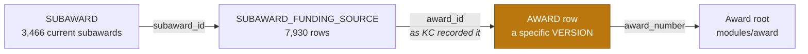

# Subaward

## The root object

`org.kuali.kra.subaward.bo.SubAward` maps to `KCOEUS.SUBAWARD` — 93,061 rows covering
3,466 subawards. The primary key is `SUBAWARD_ID`; the business key is `SUBAWARD_CODE`
plus `SEQUENCE_NUMBER`.

Unlike Institutional Proposal, there is only one class mapped to `SUBAWARD`. We looked
for a lite or projection variant and there isn't one, so there was no root-class
question to settle here.

We built the graph with `scripts/build_object_graph.py --module subaward`.
`SUBAWARD_GRAPH.csv` has the machine-readable version: **32 relationships, 27 exposed,
5 excluded**.

## How Subaward versions work

Subaward gave us a third versioning pattern. We did not reuse Award's or Proposal's
rule.

```
TOTAL_SUBAWARD_ROWS              93,061
DISTINCT_SUBAWARD_CODES           3,466
MAX_SEQUENCE_ROWS                 3,534
MAX_SEQUENCE_DISTINCT_CODES       3,466
DUPLICATE_MAX_SEQUENCE_CODES         62
SUBAWARDS_WITH_ONE_ACTIVE         3,462
SUBAWARDS_WITH_NO_ACTIVE              3
SUBAWARDS_WITH_MANY_ACTIVE            1
ACTIVE_NOT_AT_MAX_SEQUENCE            5
```

`MAX(SEQUENCE_NUMBER)` is badly non-unique here. 62 subaward codes have more than one
row at their highest sequence — Award had 10 and Proposal had none. We checked what
those duplicate rows look like:

| Pattern at max sequence | Codes |
|---|---|
| ACTIVE + ARCHIVED | 57 |
| ACTIVE + ARCHIVED + ARCHIVED | 3 |
| ACTIVE + 4 × ARCHIVED | 1 |
| ACTIVE + ACTIVE | 1 |

So in 61 of 62 cases `ACTIVE` picks the right row cleanly. That is why we evaluate
`ACTIVE` first.

We also found 5 codes where the ACTIVE row sits *below* the highest sequence. In every
one of those the higher row is `PENDING` — an amendment someone started but has not
activated. Sorting by sequence first would hand Huron those pending rows, which is
another reason ACTIVE comes first.

### Subaward 747

One code has two ACTIVE rows, both at sequence 3, both finalized in KEW. They are not
identical:

| SUBAWARD_ID | Finalized | Amount rows |
|---|---|---|
| 3849 | 12:05:21 | 0 |
| 3850 | 12:06:53 | 1 |

3850 was finalized 92 seconds later and carries a `SUBAWARD_AMOUNT_INFO` row that 3849
does not. It is the later and more complete record, so we tie-break on
`UPDATE_TIMESTAMP` rather than reaching straight for the surrogate key. We checked
whether timestamps ever tie inside an ACTIVE max-sequence group anywhere in production
— they don't — so this is deterministic on its own. `SUBAWARD_ID` stays as a last
resort but is never actually needed today.

### The three with no ACTIVE row

Codes 1427 (CANCELED), 3699 and 3912 (both PENDING). All three are single-row families,
so the fallback branch keeps them without any ambiguity.

### The rule

Prefer ACTIVE → highest sequence → latest `UPDATE_TIMESTAMP` → highest `SUBAWARD_ID`.
That gives exactly **3,466 rows for 3,466 subaward codes**, 3,463 chosen by ACTIVE and
3 by the fallback. `SELECTION_RULE` on the root says which branch picked each row.
See `sql/huron_subaward_latest_version_validation.sql`.

## How Subaward connects to Award

This is the join that attaches the Subaward graph to the Award graph, and it has a
wrinkle worth understanding.



`SUBAWARD_FUNDING_SOURCE.AWARD_ID` points at one specific `AWARD` row — a single award
*version* — not at the award as a whole. That is deliberate in KC: the link records the
award version that existed when the subaward was funded.

We checked what that means in practice. Of the 7,930 funding rows on current subawards,
**5,846 (74%) point at an award version that has since been superseded**. Only 2,084
point at the version that is current today.

We kept the link exactly as KC recorded it. The recorded version is real history, and
once it is replaced with the current version it cannot be recovered.

To reach the Award root, join on the award number:

```sql
huron_subaward_funding_source.funding_award_number = huron_award.award_number
```

We verified every referenced `AWARD_NUMBER` resolves to a selected Award root, so
nothing is orphaned by that route. There are no orphan `AWARD_ID` values at all. The
dataset also carries `FUNDING_AWARD_VERSION_IS_CURRENT` and `CURRENT_AWARD_ID` so you
can see at a glance whether the recorded version is still the live one.

3,431 of the 3,466 current subawards have at least one funding source. One has 40.

## SUBAWARD_TYPE_CODE

We had this flagged as unresolved from the Award work — there is no `SUBAWARD_TYPE`
table in KCOEUS, and searching by name finds nothing.

The OJB mapping answers it: `subAwardType` on `SubAward` points at `AwardType`. Subaward
reuses the Award type lookup. All 11 codes in production resolve against `AWARD_TYPE`
with nothing unmatched:

> 1 = Cooperative Agreement, 2 = Contract, 4 = Consortium Agreement, 5 = Grant,
> 6 = Sub-award - Grant, 8 = Other Transaction Agreement, 9 = Intergovernmental
> Personnel Agreement, 11 = Sub-award - Contract, 12 = Clinical Trial Agreement,
> 13 = CRADA, 19 = Sub-award - OTA

This is a good example of why we read the ORM instead of guessing from table names.

`COST_TYPE` needed a similar look. It is a `NUMBER` on `SUBAWARD` but
`SUBCONTRACT_COST_TYPE.COST_TYPE_CODE` is `VARCHAR2`, so the join needs `TO_CHAR`. All
three values resolve.

## Who is on a subaward

`SUBAWARD_CONTACT` offers two identities in the ORM — `ROLODEX_ID` and
`REQUISITIONER_ID` — but production only uses one. `ROLODEX_ID` is NULL on all 194,207
rows and `REQUISITIONER_ID` is populated on every one.

`REQUISITIONER_ID` is a KIM person id. As on Award, there is no ORM relationship from
here to a person table — KC resolves the name at runtime — so we expose the id and do
not attempt to join a name onto it.

There is no `PERSON_ID` column on `SUBAWARD_CONTACT` at all, which is worth knowing
before anyone goes looking for one.

The subaward root separately carries `SITE_INVESTIGATOR`, which *is* a Rolodex id and
does join: 77,130 rows populated, 77,127 of them matching a `ROLODEX` row.

## Money

Two tables, and they do different jobs.

`SUBAWARD_AMOUNT_INFO` is modification history — 10,761 rows across the current
subawards. Each row is one modification with its own obligated and anticipated change,
its own effective and performance dates, and its own modification type. It is not a
running balance, so we kept it as a child collection rather than flattening anything
into the root.

`SUBAWARD_AMT_RELEASED` is the invoice / amount-released side. BU has barely used it:
the whole table holds 2 rows and neither belongs to a current subaward, so the query
returns nothing today. We kept it because the structure is part of the model.

## BU-specific parts

`SUBAWARD_EXTENSION` is BU's (`edu.bu.kuali.kra.subaward.bo.SubAwardExtension`) and
holds exactly one business field, `DATE_RECEIVED`. It is 1:1 on `SUBAWARD_ID` — 93,060
rows, 93,060 distinct ids, no orphans — and populated on every row with 2,825 distinct
values, so it carries real information. Because it is one field on a clean 1:1, we
folded it into the root instead of making a separate dataset for it.

`SUBAWARD_TEMPLATE_INFO` is where the agreement terms live: 48 business columns covering
copyright type, carry-forward and program-income treatment, invoicing contacts, animal
and human-subject flags, data sharing, MPI leadership, and the FFATA/CCR registration
answers. KC declares it as a collection, but in production it is 1:1 — 93,061 rows,
93,061 distinct subaward ids, never more than one per subaward. We kept it as its own
dataset rather than adding 48 columns to the root, but it can be joined 1:1 safely.

BU has **15 custom attributes** configured for `SAWD`. This is the cleanest custom-data
picture of the three modules so far: the same 15 attributes are in use, nothing is
populated that is not attached to `SAWD`, and no row points at a missing definition.
One attribute has rows but no non-NULL value.

## Backup and deleted tables

Subaward has more backup tables than any other area — 15 of them, holding over a
million rows between them. The broad discovery already excluded them by name, but we
checked whether any is actually wired into the live model rather than trusting the
naming.

Five are referenced somewhere in the Kuali source. Four of those references are one-time
migration scripts under `coeus-db/.../migration/sql/` — `V1608_091__bu_migrate_modification_type.sql`
and similar — which is exactly what you would expect of a backup taken before a repair.

The fifth, `VH_SUBAWARD_BAK_1610_005`, is referenced from Java, which looked more
interesting until we read it:

```java
CREATE TABLE VH_SUBAWARD_BAK_1610_005 AS SELECT * FROM VERSION_HISTORY WHERE ...
```

The code *creates* the backup. It lives in `coeus-db-data-conv`, a one-time conversion
utility that is not even a module in the application build.

None of the 15 is referenced by the ORM, the running application, or the UI. They stay
out of the graph.

## Excluded relationships

| Relationship | Why |
|---|---|
| `subAwardDocument` | KEW workflow routing header — platform plumbing, not Grants data |
| `versionHistory` | framework versioning bookkeeping |
| `subAwardNotifications` | notification send log, operational |
| 2 × `MANY_TO_ONE_INVERSE` | inverse navigation back to the root; the child datasets already carry the keys |

Three collections are empty at BU and produce no rows: `SUBAWARD_CLOSEOUT`,
`SUBAWARD_REPORTS` and `SUBAWARD_TEMPLATE_ATTACHMENTS` (0 rows each). We kept them in
the graph because knowing the structure exists is still useful when mapping.

## Things we still need to confirm

- `SUBAWARD_AMT_RELEASED` has 2 rows in total. Is BU planning to use invoice tracking in
  HRS, or is this feature simply unused?
- `SUBAWARD_CLOSEOUT`, `SUBAWARD_REPORTS` and `SUBAWARD_TEMPLATE_ATTACHMENTS` are empty.
  Same question — unused feature or something handled elsewhere?
- 74% of funding-source links point at superseded award versions. We preserved them as
  recorded, but whether Huron wants the historical version or the current one when
  loading is a migration decision rather than a mapping one.
- One SAWD custom attribute has rows but no values anywhere.
